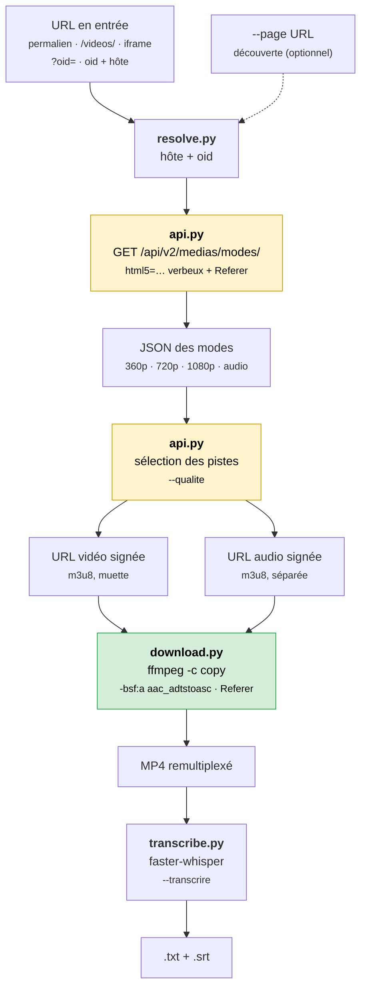

# Notes techniques

Le fonctionnement d'UbiCast n'est pas documenté publiquement. Ce document
décrit ce qui a été observé, et sert de point de départ si l'outil cesse un
jour de fonctionner.

## Localiser l'endpoint

Le HTML d'un permalien ne contient aucune source exploitable : ni `<video src>`,
ni `.m3u8`, ni `.mp4`. Le lecteur construit sa source en JavaScript après
chargement. L'URL du média est donc à chercher dans le trafic, pas dans la page.

Dans les outils de développement (`F12`), onglet **Réseau**, option *Conserver
le journal* activée, filtre `XHR`/`Fetch`, puis rechargement : une requête part
avant tout appel à un domaine CDN.

```
GET /api/v2/medias/modes/?oid=v1260a1b2c3d
    &html5=webm_ogg_ogv_oga_mp4_m4a_mp3_m3u8&yt=yt&embed=embed
```

Un filtre sur `m3u8` confirme la structure : **deux** manifestes distincts sur
un domaine tiers (`*.cdn77.com`), `media_720_…` et `audio_0_…`.

## Réponse de l'endpoint

```jsonc
{
  "success": true,
  "names": ["360p", "720p", "1080p", "audio"],

  "360p":  { "resource": { "url": "https://…/media_360_….m3u8?…",  "height": 360  } },
  "720p":  { "resource": { "url": "https://…/media_720_….m3u8?…",  "height": 720  } },
  "1080p": { "resource": { "url": "https://…/media_1080_….m3u8?…", "height": 1080 } },

  "audio": { "tracks": [ { "url": "https://…/audio_0_….m3u8?…" } ] }
}
```

- `names` énumère les modes disponibles ; c'est la liste à parcourir.
- Un mode vidéo porte une clé `resource` (URL + `height`), le mode audio une
  clé `tracks` (liste d'URLs).
- La présence d'un mode `audio` séparé implique que **les pistes vidéo sont
  muettes**. Télécharger le seul manifeste vidéo produit un fichier sans son,
  sans message d'erreur.
- Les URLs portent une signature à durée de vie courte : elles ne peuvent être
  ni devinées, ni mises en cache, ni partagées. L'outil les régénère à chaque
  exécution et n'en écrit jamais sur disque.

Quand `height` est absent, la hauteur reste déductible du nom du mode
(`"720p"` → 720) ; `pick_tracks()` gère les deux cas.

## Le paramètre `html5`

Simplifier la requête en `?oid=…` seul renvoie `"success": true` et une liste de
modes **sans aucune URL**. Pas d'erreur, pas de code HTTP anormal : une réponse
inutilisable qui ressemble à un succès.

`html5=webm_ogg_ogv_oga_mp4_m4a_mp3_m3u8` n'est pas un drapeau décoratif mais la
déclaration de capacités du client — la liste des conteneurs et codecs qu'il sait
lire, séparés par `_`. Sans elle, le serveur considère que le client ne peut rien
lire et ne propose aucune source. `yt=yt` et `embed=embed` complètent le profil
d'appel. La chaîne du lecteur est donc rejouée telle quelle, sans nettoyage.

## En-tête `Referer`

L'endpoint `modes` et le CDN vérifient le `Referer` ; sans lui, `403`. Il doit
donc aussi être transmis à ffmpeg, qui télécharge les segments HLS.

## Commande ffmpeg

```bash
ffmpeg -headers "Referer: https://mediaserver.exemple.fr/\r\n" -i <video.m3u8> \
       -headers "Referer: https://mediaserver.exemple.fr/\r\n" -i <audio.m3u8> \
       -map 0:v:0 -map 1:a:0 -c copy -bsf:a aac_adtstoasc sortie.mp4
```

| Option | Raison |
| --- | --- |
| `-headers` répété | Les options d'entrée s'appliquent à l'entrée qui **suit**. Un seul `-headers` en tête ne couvrirait que la première : la piste audio partirait sans `Referer`. |
| `-c copy` | Remultiplexage sans réencodage : aucune perte, CPU quasi nul, débit limité par le seul réseau. |
| `-bsf:a aac_adtstoasc` | L'AAC transporté par HLS arrive en conteneur ADTS ; le MP4 attend de l'ASC. Sans ce filtre, le remux passe mais l'audio est illisible. |
| `-map 0:v:0 -map 1:a:0` | Sélection explicite des flux, plutôt que l'arbitrage par défaut de ffmpeg. |

L'écriture se fait dans un fichier `.mp4.part`, renommé après un code de sortie
`0` : une interruption ne laisse jamais de MP4 tronqué qui serait pris pour un
téléchargement terminé. Le muxer est passé explicitement par `-f mp4`, puisque
l'extension ne permet plus de le déduire.

## Chaîne de traitement


